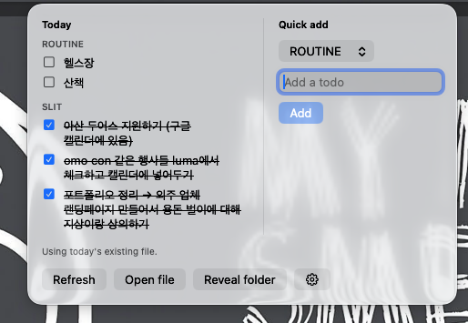

# TodoMenu

A lightweight macOS menu bar app for daily markdown todos.

<!-- Add screenshot here -->


## Features

- Lives in the menu bar, no Dock icon
- Auto-creates a daily `YYYY-MM-DD TODO.md` file in your notes directory
- Organizes todos into four sections: `ROUTINE`, `SLIT`, `SPEC`, `OTHERS`
- Toggle checkboxes directly from the menu bar
- Quick-add todos without opening any editor
- Optional scaffold template for consistent daily file structure
- Opens files in Obsidian via URL scheme
- Watches for file changes and refreshes automatically
- Detects day rollover at midnight and switches to the new day's file

## Requirements

- macOS 14 or later
- Swift 6.0 or later

## Build & Install

**Build:**

```sh
swift build
swift test
```

**Package and install:**

```sh
./Scripts/package_app.sh
cp -R TodoMenu.app ~/Applications/
open ~/Applications/TodoMenu.app
```

To launch at login, go to System Settings → General → Login Items and add TodoMenu.

## Usage

On first launch, open the menu bar icon and configure:

- **Notes directory** — where your daily `YYYY-MM-DD TODO.md` files live
- **Scaffold template** (optional) — a markdown template copied into each new daily file

Config is stored at `~/Library/Application Support/TodoMenu/config.json`.

## Project Structure

```
Sources/
  TodoDomain/       Core parsing and mutation logic
  TodoMenuApp/      SwiftUI app, UI, config, lifecycle
Tests/              Unit tests
Scripts/            Build and packaging scripts
```

## License

MIT

---

## 한국어

# TodoMenu

macOS 메뉴 바에서 매일 마크다운 할 일을 관리하는 가벼운 앱입니다.

## 기능

- Dock 아이콘 없이 메뉴 바에서만 동작
- 매일 `YYYY-MM-DD TODO.md` 파일을 자동 생성
- 할 일을 네 가지 섹션으로 구분: `ROUTINE`, `SLIT`, `SPEC`, `OTHERS`
- 메뉴 바에서 직접 체크박스 토글
- 에디터를 열지 않고 메뉴 바에서 바로 할 일 추가
- 일관된 파일 구조를 위한 스캐폴드 템플릿 지원 (선택 사항)
- URL 스킴을 통해 Obsidian에서 파일 열기
- 파일 변경 감지 및 자동 새로고침
- 자정에 날짜 전환을 감지하고 새 파일로 자동 전환

## 요구 사항

- macOS 14 이상
- Swift 6.0 이상

## 빌드 및 설치

**빌드:**

```sh
swift build
swift test
```

**패키징 및 설치:**

```sh
./Scripts/package_app.sh
cp -R TodoMenu.app ~/Applications/
open ~/Applications/TodoMenu.app
```

로그인 시 자동 실행하려면 시스템 설정 → 일반 → 로그인 항목에서 TodoMenu를 추가하세요.

## 사용법

처음 실행하면 메뉴 바 아이콘을 눌러 다음 항목을 설정합니다:

- **노트 디렉토리** — 매일 생성되는 `YYYY-MM-DD TODO.md` 파일이 저장될 경로
- **스캐폴드 템플릿** (선택 사항) — 새 일일 파일에 복사할 마크다운 템플릿

설정은 `~/Library/Application Support/TodoMenu/config.json`에 저장됩니다.

## 프로젝트 구조

```
Sources/
  TodoDomain/       핵심 파싱 및 변환 로직
  TodoMenuApp/      SwiftUI 앱, UI, 설정, 라이프사이클
Tests/              단위 테스트
Scripts/            빌드 및 패키징 스크립트
```

## 라이선스

MIT
